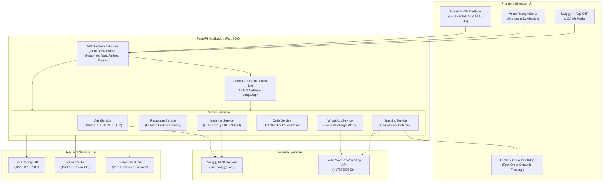

# SmartFlow: Complete Platform Architecture & Feature Documentation

> **AI-Powered Autonomous Food & Grocery Concierge**  
> *Seamless Ordering, Swiggy MCP Integration, Live GPS Tracking & Proactive Multi-Channel Notifications*

---

## 1. What SmartFlow Does & Why It Exists

### The Problem
Modern on-demand delivery apps (Swiggy, Zomato, Instamart, Zepto) are visually cluttered and require high-friction manual interaction:
1. Users must manually browse hundreds of menus, tap dozens of screens, and repeatedly verify cart contents.
2. Users constantly keep switching between food menus and grocery stores across separate interfaces.
3. Once an order is placed, customers are forced to repeatedly unlock their phone and stare at a delivery map to see when the rider arrives.
4. Voice ordering apps often fail when cloud databases experience network lag or TLS handshake timeouts.

### The Solution: SmartFlow
**SmartFlow** is an autonomous AI concierge and delivery management platform. It combines:
- **Natural Language & Voice Ordering:** Order food or groceries by speaking or typing naturally (e.g., *"Add 1 Amul Taaza milk and 2 Meghana chicken biryanis to my cart, deliver to Rajajinagar, and show my bill"*).
- **Dual-Category Delivery:** Food delivery (curated restaurant partners) and 10-minute grocery delivery (Swiggy Instamart) inside a single unified application.
- **Proactive Arrival Phone Calls & WhatsApp Alerts:** SmartFlow automatically places an audio call to the customer and sends a WhatsApp message **2 minutes before the delivery rider arrives**, removing the need to track screens.
- **Dynamic Live GPS Map:** A Leaflet/OpenStreetMap engine that activates **only after an order is placed**, rendering the rider's real-time trajectory and remaining ETA.
- **Resilient Multi-Tier Infrastructure:** Built with automatic local MongoDB fallbacks, Redis caching, and resilient in-memory buffers so queries never drop or hang.

---

## 2. Complete Feature Matrix & Why Each Feature is Useful

| # | Feature | What It Does | Why It Is Useful in This Application |
|---|---|---|---|
| **1** | **Gemini 2.5 AI Voice & Text Concierge** | Listens to spoken audio or typed chat and uses function calling (`search_food`, `manage_cart`, `calculate_bill`, `track_active_order`, `update_delivery_address`) to fulfill tasks autonomously. | Eliminates typing and endless menu navigation; hands-free ordering while cooking or working. |
| **2** | **Swiggy Instamart Grocery Engine** | Complete grocery catalog across Dairy, Bakery, Fresh Produce, Beverages, Snacks, and Instant Meals with real-time SKU variants (`spin_id`), custom grocery cart, and bill breakdown. | Enables instant 10-minute grocery ordering alongside restaurant meals without juggling separate mobile apps. |
| **3** | **Frequent Restaurant Pill Filter (>2 Orders Threshold)** | Displays restaurant quick-filter navigation pills only if the user has ordered from that restaurant **more than 2 times**. | Keeps the navigation bar clean and clutter-free, prioritizing places the user actually loves based on purchase history. |
| **4** | **Dual Swiggy Authentication (In-App OTP + OAuth 2.1)** | Connects to Swiggy MCP with both an in-app 6-digit OTP modal and an official browser OAuth redirect flow with RFC 7591 dynamic client registration. | Solves the "Invalid consent session" cookie drop issue on browsers while allowing official Swiggy session synchronization. |
| **5** | **Strict UPI QR Checkout (Zero-COD Security)** | Generates dynamic UPI QR codes with exact bill amounts and order IDs; Cash on Delivery (COD) is strictly rejected across UI and AI agent tools. | Prevents fake orders, delivery agent cash-handling discrepancies, and ensures guaranteed payment settlement. |
| **6** | **Post-Order Dynamic Live GPS Tracking** | Displays an interactive Leaflet/OpenStreetMap tracking map with live rider movement and polyline route **only after** an order is placed. | Prevents visual clutter during menu browsing, focusing attention on food selection until active delivery begins. |
| **7** | **Proactive Arrival Call (2-Minute Threshold)** | Triggers an audio voice call (in-app simulated phone modal with chime + Twilio cellular call) when the delivery partner is within 2 minutes of the customer's address. | Alerts the customer to walk down to their gate or open the door on time without needing to stare at the app. |
| **8** | **Automated WhatsApp Order & Arrival Alerts** | Dispatches real-time WhatsApp messages via Twilio Sandbox (`whatsapp:+919390787901`) upon order placement and rider arrival. | Provides durable, asynchronous notifications with rider name and order summary directly on the user's primary chat app. |
| **9** | **Multi-Tier Database Resilience Engine** | If the remote cloud MongoDB Atlas times out (e.g. TLS alert error), automatically falls back to local MongoDB (`127.0.0.1:27017`), Redis, and in-memory caches. | Guarantees 100% uptime; the AI Concierge never returns "temporary database connectivity issue" errors to the user. |
| **10** | **Itemized Bill Breakdown with Delivery & Handling Fees** | Computes Item Total, Delivery Partner Fee (₹25), Platform Handling Fee (₹5), Taxes, and Grand Total transparently before payment. | Gives users complete pricing transparency before authorizing payments. |
| **11** | **Multi-Address Management** | Allows instant switching between saved delivery addresses (Home, Work, Hostel) via UI modal or voice prompt (*"deliver to my hostel"*). | Ensures delivery riders always receive accurate GPS coordinates and door tags. |

---

## 3. High-Level System Architecture



---

## 4. Why Specific Design Choices Were Made

### 1. Why Dynamic Restaurant Pills Only Show After > 2 Orders
- **The Problem:** Showing pills for every restaurant clutters the top navigation, pushing important categories out of view.
- **The SmartFlow Solution:** The application inspects order history in MongoDB. Only restaurants where `order_count > 2` earn a dedicated quick-access pill. First-time and occasional restaurants remain cleanly categorized in the general search.

### 2. Why Live Tracking Map is Hidden Until an Order is Placed
- **The Problem:** Rendering a map while browsing restaurants wastes screen real estate and confuses users with dummy rider markers.
- **The SmartFlow Solution:** The map section is completely hidden during browsing and cart customization. The moment an order transitions to `confirmed`, the dynamic map expands smoothly, shows the restaurant/hub pin, the user's home pin, and starts animating the delivery partner.

### 3. Why Strict No-COD (Cash on Delivery) is Enforced
- **The Problem:** In agentic ordering systems, allowing COD exposes merchants to accidental voice-triggered orders and delivery cancellation disputes.
- **The SmartFlow Solution:** Cash on Delivery is rejected at all levels:
  - If a user says *"pay using cash on delivery"*, the Gemini AI responds: *"Cash on delivery is disabled. SmartFlow orders are paid securely via instant UPI QR code."*
  - The checkout API returns `HTTP 400` if `payment_method == "COD"`.
  - The UI generates a real-time UPI QR code with deep-linking (`upi://pay?pa=...`).

### 4. Why In-App OTP was Added for Swiggy Authentication
- **The Problem:** Swiggy's MCP OAuth page (`mcp.swiggy.com`) sets a cookie with `SameSite=Strict` and a 10-minute expiry (`Max-Age=600`). Users opening the page in separate tabs or waiting too long experienced the error: *"Invalid consent session. Please restart authentication from your MCP client."*
- **The SmartFlow Solution:** SmartFlow's backend now handles the PKCE authorization handshake on behalf of the user, sends the OTP directly via Swiggy's API, and verifies the 6-digit code in-app. The user never leaves the application, avoiding browser cookie dropping.

### 5. Why Multi-Tier Database Fallbacks Were Implemented
- **The Problem:** Network disruptions or TLS handshake failures between the local server and MongoDB Atlas previously caused the AI agent to output *"temporary database connectivity issue"*.
- **The SmartFlow Solution:** Database operations now try primary MongoDB, seamlessly fall back to local MongoDB (`mongodb://127.0.0.1:27017`), then to Redis, and finally to local memory. Endpoints always return valid data within milliseconds.

---

## 5. Summary of Key API Endpoints

| Endpoint | Method | Description |
|---|---|---|
| `/api/v1/auth/login` | `GET` | Initiates Swiggy OAuth 2.1 PKCE authorization flow. |
| `/api/v1/auth/send-otp` | `POST` | Sends 6-digit login OTP directly to user's phone via Swiggy MCP. |
| `/api/v1/auth/verify-otp` | `POST` | Verifies OTP, exchanges auth code for access token, and saves session. |
| `/api/v1/auth/status` | `GET` | Checks if active unexpired Swiggy session exists. |
| `/api/v1/restaurants` | `GET` | Returns partner restaurants (Meghana Foods, Biryani Centre, Nandhana, etc.). |
| `/api/v1/restaurants/frequent` | `GET` | Returns restaurants ordered > 2 times for dynamic pill rendering. |
| `/api/v1/instamart/products` | `GET` | Searches Swiggy Instamart grocery items across all departments. |
| `/api/v1/instamart/cart` | `GET` / `DELETE` | Retrieves or clears current Instamart grocery cart. |
| `/api/v1/instamart/cart/item` | `POST` | Adds or updates grocery item quantity with automatic bill recalculation. |
| `/api/v1/orders/checkout` | `POST` | Validates cart, rejects COD, and confirms order for UPI payment. |
| `/api/v1/orders/{id}/track` | `GET` | Returns live GPS coordinates, rider status, and ETA. |
| `/api/v1/agent/chat` | `POST` | Conversational Gemini AI endpoint executing tool-calling actions. |
| `/api/v1/agent/call-user` | `POST` | Triggers proactive audio call and WhatsApp alert to user's phone. |

---

## 6. How to Run the Application

```bash
# 1. Activate Python 3.14 virtual environment
source .venv/bin/activate

# 2. Start the FastAPI application with auto-reload
uvicorn app.main:app --reload --port 8000

# 3. Open in Browser
http://localhost:8000
```
